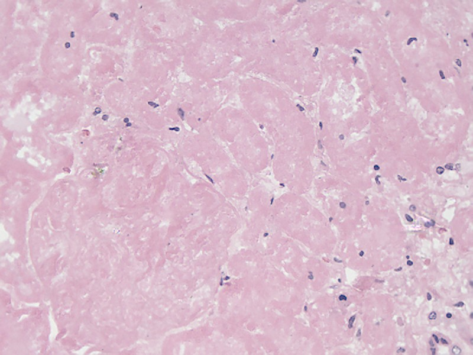
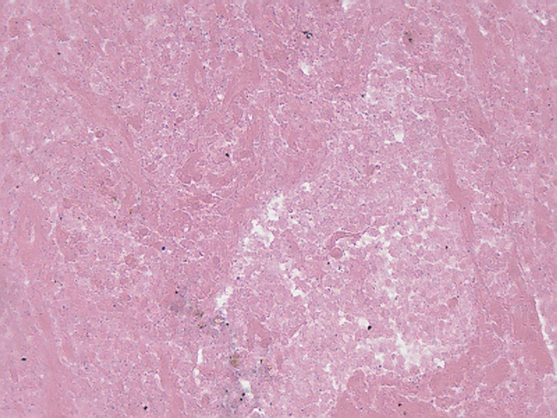
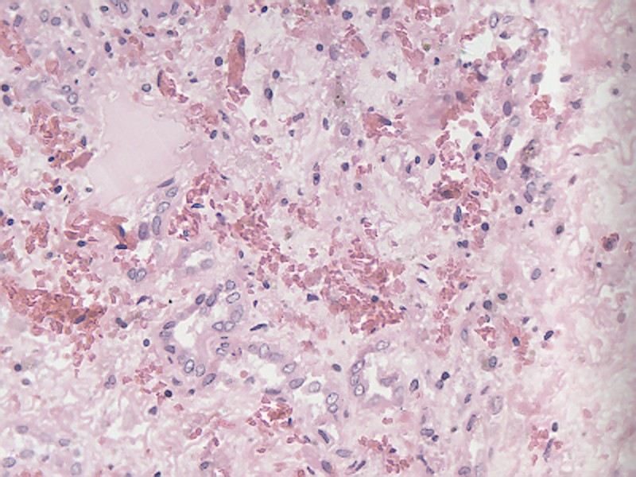
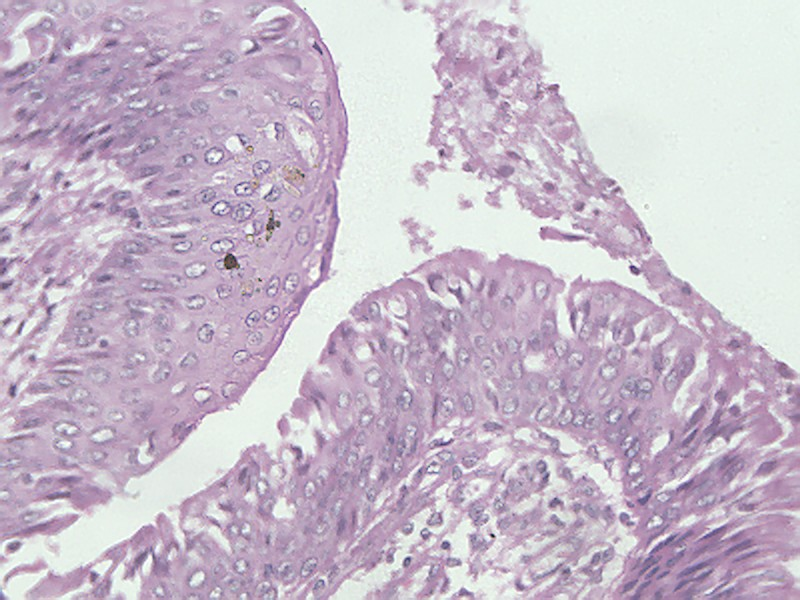

病理学
======
<!-- 实验课: D312/D314 -->

细胞和组织的适应与损伤
------
### 细胞和组织的适应
1. [萎缩](#Atrophy)
    - 定义: 发育正常的组织器官体积缩小
    - 分类
        + 生理性萎缩
            * 胸腺青春期萎缩
            * 生殖腺更年期萎缩
            * 老年性萎缩
        + 病理性萎缩
            * 营养不良性萎缩
            * 压迫性萎缩 (结石)
            * 废用性萎缩
            * 神经性萎缩 (脊髓黑质炎)
            * 内分泌性萎缩 (脑垂体损伤)
            * 缺血性萎缩 (动脉硬化症)
    - 病理变化
        + 肉眼
            * 体积变小、质量减少、颜色变深
            * 血管蛇形盘曲
        + 镜下
            * 实质细胞数目减少、体积减小
            * 胞浆内可见脂褐素沉着
1. 肥大
    - 定义: 实质细胞体积增大导致细胞、组织或器官体积增大
    - 分类
        + 生理性: 妊娠子宫、运动员骨骼肌
        + 病理性: 高血压病心肌
    - 病理变化: 体积增大、质量增大
1. 增生
    - 定义: 实质细胞数量增多导致细胞、组织或器官体积增大
    - 分类
        + 生理性增生
            * 代偿性增生 (肝细胞)
            * 激素性增生
        + 病例性增生
1. [化生(metaplasia)](#Metaplasia)
    - 定义: 一种分化成熟的细胞类型被另一种分化成熟的细胞类型所取代的过程
    - 分类
        * 气管鳞状细胞化生
        * 支气管浆液性腺体黏液性化生
        * 胃肠上皮化生

### 细胞和组织的损伤
#### 损伤原因和发生机制
1. 损伤: 当及体内外环境改变超过组织和细胞的适应能力后, 引起受损细胞和细胞间质
        发生物质代谢、组织化学、超微结构乃至光镜和肉眼可见的异常变化.
1. 损伤原因:
    - 物理损伤
    - 化学物质
    - 缺氧、缺血, 导致ATP减少, pH下降, 炎症介质释放.
    - 生物因素
    - 免疫损伤
    - 其他:遗传因素等
1. 发生机制:
    - ATP生成不足或耗竭
    - 细胞膜损伤
    - 活性炎症物质释放
    - 细胞内钙超载

#### 损伤的形式和形态学变化
##### 变性
1. 可逆性性损伤 (变性)
    - 细胞水肿/[水样变性](#HydropicDegeneration)
        + 部位: 心、肝、肾
        + 机制: Na⁻-K⁺ATPase功能障碍导致细胞内水的过度积聚
        + 病理变化
            * 体积增大
            * 颜色变浅 (肝脏肝血窦受压迫导致缺血)
            * 包膜紧张, 切面隆起
            * 镜下细胞体积增大, 染色浅, 有时会出现气球样变性
    - [脂肪变性](#FattyDegeneration)
        + 定义: 脂肪细胞以外的细胞内出现脂滴或脂滴明显增多
        + 部位: 肝、心、肾
        + 病理变化
            * 体积增大
            * 颜色变黄
            * 切面有油腻感
        + 肝脂肪变性分类
            * 小叶中央型 (静脉阻塞导致肝缺血)
            * 小叶周边型 (有机磷中毒)
            * 全小叶型
        + 心肌脂肪变性
            * 部位: 乳头肌、心内膜下心肌
            * 病理变化: 虎斑心
        + 鉴别方法: 苏丹III染色冰冻切片
    - [玻璃样变性](#HyalinosisDegeneration)
        + 定义: 镜下细胞内或间质中出现HE红染、均质、半透明蛋白质蓄积.
        + 部位: 血管壁、结缔组织、细胞内
        + 细动脉壁玻璃样变性 (细动脉硬化)
            * 病因: 高血压、糖尿病
            * 部位: 肾、脑、脾的细动脉
        + 纤维结缔组织玻璃样变性 (瘢痕组织)
        + 细胞内玻璃样变性
            * 病因: 蛋白尿 (肾小管)
            * 部位: 肾小管上皮细胞、干细胞、浆细胞等
    - 淀粉样变性
        + 定义: 免疫球蛋白等糖蛋白沉积, 碘试剂反应阳性, 刚果红染色阳性
        + 见于: 慢性感染、骨髓瘤等
    - 病理性色素沉着
        + 分类
            * 内源性色素 (含铁血黄素、脂褐素、胆色素、黑色素)
            * 外源性色素 (碳末等)
        + 含铁血黄素沉积
            * 病因: 巨噬细胞吞噬降解红细胞, 其中Fe³⁺与蛋白质结合形成褐色铁蛋白微粒聚集体.
            * 部位: 慢性肺瘀血、动脉内血栓等
    - 病理性钙化
        + 定义: 骨和牙齿以外的组织出现固态钙盐沉积 (紫蓝色颗粒)
        + 分类
            * 营养不良性钙化: 坏死、异物内形成, 血钙正常
            * 转移性钙化: 全身钙磷代谢异常, 血钙异常增高
1. 脂肪浸润: 非脂肪变性, 同时包含脂肪组织与心肌细胞.

##### 坏死
1. 不可逆性损伤
    - 坏死: 以酶溶性变化为特点的活体内局部组织细胞的死亡.
        + 核形态改变
            * 核固缩
            * 核碎裂
            * 核溶解
        + 胞浆形态改变: 嗜酸性增强
        + 细胞间质变化: 基质崩解
    - 凋亡: 体内外某些因素出发细胞内预存的死亡程序导致细胞主动死亡的方式.
        + 特点: 无扩大的组织损伤和炎症反应
        + 形态学特点
            * 细胞体积缩小，胞浆浓缩
            * 细胞核染色质边集
            * 细胞膜与细胞器膜完整
            * 周围无炎症反应
        + 诱导基因: p53, Bax, Bcl-XS, Bad, FasL
        + 抑制基因: Bcl-2, Bcl-XL, Bcl-AL

1. 坏死分类
    - [凝固性坏死](#CoagulationNecrosis)
        + 病因: 动脉血流阻断引起缺血性损伤
        + 特点: 坏死组织蛋白质变性凝固, 结构消失, 组织轮廓尚存. 坏死区灰黄、干燥、质实状.
    - [干酪样坏死](#CaseousNecrosis) (特殊凝固性坏死)
        + 病因: 结核菌等细菌感染
        + 特点: 坏死区湿润, 油腻, 似奶酪. **无组织轮廓**.
    - 液化性坏死
        + 病因: 细菌感染
        + 特点: 坏死组织因酶水解发生液化
        + 脑组织坏死: 脑组织富含水分和脂质, 可凝固的蛋白质少
        + 胰腺组织坏死: 富含蛋白酶
    - 脂肪坏死
        + 酶解性: 胰腺炎
        + 外伤性
    - 纤维素样坏死
        + 部位: 结缔组织、血管壁
        + 特点: 坏死组织细丝状, 颗粒状, 无结构, HE红染, 纤维素样
    - 坏疽
        + 定义: 大面积组织坏死伴有腐败菌感染
        + 分类
            * 干性坏疽: FeS导致坏死组织呈黑色, 干燥, 分界清, 常见于四肢末端, 不易伴发全身感染.
            * 湿性坏疽: 颜色蓝绿色, 分界不清, 瘀血水肿, 伴发感染, 伴恶臭, 常见于四肢和与外界相通脏器
            * 气性坏疽
1. 坏死的结局
    - 溶解吸收: 病灶小, 由蛋白溶解酶降解
    - 分离排出: 病灶大, 形成溃疡或缺损
    - 机化与包裹: 肉芽组织长入并取代坏死物
    - 钙化: 病灶大, 难以机化

损伤的修复
------
### 修复和再生
1. 修复: 损伤造成机体部分细胞和组织丧失后, 机体对所形成缺损进行修补恢复的过程.
    - 完全性再生: 完全恢复原组织的结构和功能
    - 不完全性再生: 不能完全恢复原组织的结构和功能。可形成结节。
        * 纤维性修复: 通过肉芽组织增生的方式，以结缔组织修复损伤的形式, 即瘢痕性修复
1. 再生: 由损伤周围组织的同种细胞来修复的过程.
    - 生理性再生
    - 病理性再生
1. 人体细胞按再生能力强弱分类
    - 不稳定细胞（完全再生）
        * 表皮细胞
        * 黏膜被覆上皮
        * 子宫内膜上皮
        * 骨髓造血细胞
    - 稳定细胞（完全、不完全再生）
        * 肝细胞
        * 肾小管上皮细胞
        * 呼吸道、消化道腺上皮细胞，汗腺、皮脂腺
        * 平滑肌细胞
    - 永久性细胞
        * 神经细胞
        * 骨骼肌细胞
        * 心肌细胞

1. 局部微环境
    - 网状纤维支架（肝细胞），基底膜（肾小管上皮细胞）
    - 血供、感染、异物等

### 纤维性修复
1. [肉芽组织](#GranulationTissue)
    - 成分
        + 薄壁毛细血管（新生毛细血管）
        + 成纤维细胞
        + 炎性细胞
    - 病理变化
        + 肉眼: 鲜红色、颗粒状、柔软湿润, 形似鲜嫩的肉芽.
    - 作用
        + 抗感染, 保护创面
        + 填补创口及其他组织缺损
        + 机化或包裹坏死、血栓、炎性渗出物及其异物

1. 瘢痕组织
    - 定义: 肉芽组织经改建成熟形成的纤维结缔组织
    - 转变
        + 毛细血管减少，转变为小动脉和小静脉
        + 成纤维细胞转变为纤维细胞
        + 胶原增多
        + 水分减少
    - 作用
        + 保持组织器官完整性和坚固性
        + 瘢痕收缩、粘连、瘢痕组织增生过度形成瘢痕疙瘩

### 创伤愈合
1. 创伤愈合: 机体遭受外力作用, 皮肤等组织出现离断后的愈合过程.
             为包括各种组织的在城和肉芽组织增生、瘢痕形成的复杂组合.
1. 创伤愈合的类型
    - 一期愈合（创口较小）
    - 二期愈合 (有大量肉芽组织形成)

局部血液循环障碍
------
### 充血和淤血
1. 充血: 器官或局部组织的血管内血液含量增多.
1. 动脉性充血: 局部器官或组织由于动脉血输入量增多而发生的充血.
               又称主动性充血, 简称充血.
     - 分类
         + 生理性充血
             * 胃肠道黏膜
             * 骨骼肌
             * 子宫
         + 炎症性充血
         + 减压后充血
1. 静脉性充血: 局部器官或组织由于静脉血液回流受阻而发生的充血.
               又称被动性充血, 简称淤血.
     - 原因
         + 静脉受压
         + 静脉腔阻塞
         + 心力衰竭
     - 后果
         + 淤血性水肿：缺血、缺氧，血管通透性改变
         + 淤血性出血：含铁血黄素细胞
         + 淤血性硬化：间质增生
         + 实质细胞发生萎缩、变性, 甚至坏死
         + 导致侧枝循环的形成

1. 重要器官的淤血
    - 肺淤血
        + 病因: 左心衰
        + 形态
            * 肉眼：肺体积增大，暗红色或棕色，变重变硬。 **肺褐色硬化**
            * 肺泡壁毛细血管扩张充血
            * 肺泡腔水肿液漏出，出血，可见心衰细胞（含铁血黄素细胞）
            * 肺泡间质增生，肺泡壁纤维化
        + 临床病理现象
            * 气促、发绀
            * 粉红色或棕色、泡沫样痰
    - 肝淤血
        + 病因: 右心衰、肝静脉/下腔静脉回流受阻
        + 形态
            * 肉眼：黄色和暗红色相间排列。 **槟榔肝**
            * 肝小叶中央淤血
            * 肝小叶周边脂肪变性
        + 临床病理现象（淤血性肝硬化）：较轻

1. 含铁血黄素特殊染色：普鲁士蓝染色

### 出血
1. 破裂性出血
1. 漏出性出血

### 血栓形成
1. 血栓形成：在活体心血管内，血液凝固或有形成分凝集，形成固体块（血栓）的过程。
1. 血栓形成的条件（血液凝固和抗凝的动态平衡的失调）
    - 心血管内皮细胞的损伤
        + 心内膜炎
        + 动脉粥样硬化
        + 心肌梗死
    - 血流状态的改变
        + 血流减慢（长期卧床、静脉曲张）
        + 产生涡流：正常血流由内到外为血细胞（轴流）-血小板-血浆（边流），血小板不能与血管内皮接触而激活
    - 血液凝固性增加
        + 血小板和凝固因子增多
        + 纤溶系统活性降低

1. 血栓的类型和形态
    - 白色血栓（头部）
        + 部位：动脉、心室。血流较快处。
        + 形态
            * 肉眼：呈灰白色，表面粗糙，质硬（心瓣膜内呈串珠样小结节）
            * 镜下：主要由血小板小梁（淡红，均质状）与少量纤维蛋白构成
    - 混合血栓（体部）
        + 部位：血流极度缓慢或停止处。形成过程与血管外凝血相同。
        + 凝固过程
            * 血小板小梁形成
            * 凝血因子激活，血液凝固
        + 形态
            * 肉眼：呈粗糙干燥圆柱状，红白条纹相间，与血管壁粘连。可脱落。
            * 镜下：主要由血小板小梁（淡红，均质状）与充满小梁间纤维蛋白网的红细胞构成。
                    小梁周围分布中性白细胞。
    - 红色血栓（尾部）
        + 部位：静脉内
        + 形成机制：管腔完全阻塞，血液凝固
        + 形态
            * 肉眼：暗红色，光滑湿润，无粘连。可脱落。
            * 镜下：纤维素网眼内充满红细胞、白细胞
    - 透明血栓（微血栓/纤维素性血栓）
        + 组成：纤维蛋白、血小板
        + 后果
            * 微循环阻塞导致缺血
            * 凝血因子消耗，纤溶系统激活，引起继发性出血

1. 血栓按部位分类
    - 动脉血栓
        + 血栓类型：白色血栓或混合血栓
        + 疾病：动脉粥样硬化
    - 静脉血栓（阻塞性血栓）
        + 部位：多见于下肢静脉
        + 血栓类型：头部白色；体部混合；尾部红色血栓
    - 心脏瓣膜血栓
        + 血栓类型：白色血栓
        + 疾病：急性风湿性心脏病、心内膜炎

1. 血栓按血流状态分类
    - 闭塞性血栓：中小血管
    - 附壁血栓：大血管、心腔（混合血栓）
    - 赘生物：心瓣膜（白色血栓）
    - 球形血栓：左心房（因心房收缩挤压变成球形）

1. 血栓的结局
    - 软化、溶解、吸收：主要是微小血栓
    - 栓塞：脱落成为栓子
    - 机化、再通：肉芽组织增生，形成沟通性裂隙
    - 钙化：形成动/静脉石。机化后的血栓在纤维组织玻璃样变后也可钙化。

1. 血栓对机体的影响
    - 止血
    - 阻塞血管（缺血导致动脉梗死，坏疽；静脉淤血）
    - 栓塞
    - 心瓣膜变形（血栓机化; 瓣膜病）
    - 广泛出血：透明血栓

### 栓塞
1. 栓塞：循环血液中异常物质随血液流动阻塞血管管腔的现象。阻塞血管的异常物质成为栓子。
1. 栓子的运行途径
    - 右心、静脉系统：肺
    - 左心、动脉系统：全身（肾、脾、脑等）
    - 门静脉系统：肝
    - 交叉性栓塞：右心至左心（右心压力升高/房室间隔缺损/动静脉瘘）
    - 逆行性栓塞：下腔静脉内栓子由于胸腹内压骤增，逆血流方向栓塞下腔静脉所属分支。

1. 栓塞的类型
    - 血栓栓塞
        + 肺动脉栓塞
        + 体循环动脉栓塞
    - 脂肪栓塞
        + 原因：长骨骨折、脂肪组织损伤、烧伤、脂肪肝挤压伤
        + 通路
            * 大小：体循环脂滴到达肺动脉（大于20㎛），经左心到体循环（小于20㎛）
            * 数量：少量脂滴被巨噬细胞吞噬，大量脂滴引起窒息/肺水肿、右心衰
        + 后果
            * 肺：肺出血、呼吸窘迫综合征
            * 脑栓塞：点状出血、水肿、软化
            * 肾栓塞：少尿、无尿
            * 皮肤：点状出血
    - 气体栓塞
        + 空气栓塞
        + 减压病
    - 羊水栓塞
        + 原因
            * 羊水经破裂子宫静脉窦入血
            * 羊膜早破、胎盘早剥、胎儿阻塞产道
        + 通路
            * 经体循环到达肺动脉
        + 后果
            * DIC（弥漫性血管内凝血）
            * 变态反应
        + 羊水中胎儿代谢产物入血引起过敏性休克
        + 腓动脉阻塞引起反射性血管痉挛
    - 其他栓塞（细菌栓塞、肿瘤细胞栓塞）
        + 后果：梗死、继发性改变

1. 肺动脉栓塞
    - 来源：主要为下肢静脉
    - 后果
        + 小栓子栓塞：无严重影响
        + 中等大小栓子栓塞，无肺淤血，不严重；有肺淤血，栓塞
        + 大栓子，骑跨性栓塞：肺动脉主干栓塞，呼吸困难，发绀，休克。急性呼吸循环衰竭。
        + 多栓子栓塞（60%以上）：右心衰竭，猝死

1. 体循环动脉栓塞
    - 来源：瓣膜赘生物、附壁血栓（二尖瓣狭窄、心梗、动脉粥样硬化溃疡、动脉瘤）。
    - 后果
        + 单一终末支供血
        + 双重供血
        + 侧枝丰富

1. 空气栓塞
    - 原因：大静脉损伤，正压静脉输液，子宫强烈收缩
    - 后果
        + 形成泡沫样血液
        + 肺、脑小血管阻塞：胸痛、胸闷
        + 心脏搏血、回流障碍：呼吸困难、紫绀、猝死

1. 减压病
    - 原因：高气压进入低气压
    - 四肢、腹部：痉挛性疼痛
    - 肺小动脉：胸痛、胸闷
    - 脑：晕厥、瘫痪
    - 短期大量旗袍：严重血循环障碍（冠状动脉）

### 梗死
1. 梗死：器官或局部组织由于血管阻塞、血流停止缺氧而发生的坏死灶
1. 梗死形成的原因：动脉血供中断
    - 血栓形成
    - 动脉栓塞
    - 动脉痉挛
    - 血管受压（主要为静脉压迫）
1. 梗死影响因素
    - 供血血管类型
        + 双重供血
            * 肺、肝：无严重淤血不易发生梗死
        + 侧枝循环
            * 手、前臂：侧枝循环丰富，不易发生梗死
            * 脾、肾、脑：侧枝循环不丰富，易发生梗死
    - 器官、组织的耐受性
        + 不耐受：脑、心肌
        + 耐受：骨骼肌、纤维组织
    - 局部组织氧含量
        + 严重贫血：易发生梗死
        + 血供绝对减少：心力衰竭
        + 血供相对减少：剧烈运动，心肌需求量增多
    - 血管阻塞发生速度

1. 梗死的形态特征
    - 形状：多数器官呈锥形，心肌梗死呈不规则或地图状
    - 质地：多数器官为凝固性坏死，脑梗死为液化性坏死
    - 颜色
        + 贫血性梗死：灰白色，含血量少
        + 出血性梗死：暗红色，含血量多

1. 梗死的类型
    - 贫血性梗死
        + 发生特点：组织结构致密、侧枝循环不丰富，如心、肾、脾、脑。
        + 常见类型
            * 脾、肾梗死
            * 脑梗死
            * 心肌梗死
    - 出血性梗死
        + 发生条件 <!--TODO: Add -->
            * 严重淤血
            * 组织疏松
        + 常见类型
            * 肺出血性梗死
            * 肠出血性梗死
    - 败血性梗死
        + 原因：细菌性栓子引起，梗死伴细菌感染。常见于感染性心内膜炎。

1. 脾、肾梗死
    - 形态学特点
        + 梗死区形态与血管分布特点一致。脾、肾动脉呈分支状，楔形
        + 镜下：凝固性坏死
        + 周围反应：充血出血带、炎症反应
    - 结局：机化
1. 脑梗死
    - 形态学特点
        + 脑软化
        + 镜下：结构消失、胶质细胞浸润
1. 心肌梗死
    - 形态学特点
        + 不规则的凝固性坏死（土黄色）、梗死出血带
        + 镜下：凝固性坏死，白细胞浸润
1. 肺出血性梗死
    - 形态学特点
        + 梗死灶血液淤积，呈楔（锥）形、暗红色
    - 后果
        + 纤维素性胸膜炎：胸痛
        + 支气管：咳嗽
        + 出血：咯血
        + 全身：发热、WBC↑
1. 肠出血性梗死
    - 形态学特点
        + 节段性梗死，可发展为坏疽、腹膜炎
    - 后果 <!--TODO: Add -->
        + 肠壁缺氧：痉挛、剧烈腹痛
        + 肠蠕动增强

1. 梗死的结局

炎症
------
### 概述
1. 炎症：各种损伤因子引起的局部和全身反应
1. 炎症的原因
    - 理化性因子
    - 生物性因子
    - 遗传缺陷：α1-抗胰蛋白酶↓
    - 变态反应：机体免疫反应状态异常
1. 炎细胞：渗出的白细胞

1. 基本病理变化 <!--IMPORTANT-->
    - 变质：炎症局部组织发生地变性和坏死
        + 原因：直接损伤或局部循环障碍与炎症反应产物共同作用
    - 渗出：血管内血浆和白细胞（渗出物）通过血管壁渗出的过程
        + 过程
            * 血管反应
            * 血浆渗出
            * 白细胞渗出
    - 增生：实质细胞、间质细胞、炎细胞增生
    - 三者关系：顺序性/重叠性/相对为主性/相互转化性；保护性/损伤性

1. 组织坏死的炎症表现：[充血出血带](#HyperemiaBleedingBand)形成，炎症细胞浸润
1. 炎症的局部表现：红、肿、热、痛和功能障碍
1. 炎症的全身反应：发热、厌食、肌蛋白溶解加速、补体和凝血因子合成减少、末梢血白细胞数目改变

### 渗出
1. 渗出血流动力学改变
    - 小动脉短暂收缩（痉挛）
    - 小动脉扩张，血流加速
    - 小动脉继续扩张，通透性增加，血浆渗出
    - 血流速度减慢，血液浓缩，轴流消失。白细胞边集、黏着、游出。
    - 血液淤滞，红细胞漏出

1. 影响血浆渗出的因素
    - 血管通透性升高
        + 原因：致炎因子和炎症中化学物质共同作用的结果
        + 表现
            * 内皮细胞收缩、间隙增宽
            * 内皮细胞受损
            * 新生血管的细胞链接不完善
            * 穿胞作用
    - 血管内流体静压升高
    - 组织渗透压升高
        + 原因：组织坏死分解（胶体、晶体渗透压升高）

1. 通透性增高时的渗出次序
    - 白蛋白
    - 球蛋白
    - 纤维蛋白
    - （红细胞漏出）

1. 白细胞渗出
    - 方式：阿米巴运动
    - 时项
        + 早期：中性粒细胞、单核细胞
        + 后期：淋巴细胞
    - 种类
        + 一般感染：中性粒细胞
        + 伤寒：单核细胞
        + 病毒感染：淋巴细胞
        + 寄生虫：嗜酸性粒细胞
        + 过敏反应：嗜酸性粒细胞
        + 急性炎症：中性粒细胞
        + 慢性炎症：淋巴细胞、单核细胞
    - 异常：人类白细胞粘附缺陷（LAD）表现为反复细菌感染

1. 白细胞趋化作用
    - 定义：白细胞朝着化学刺激物（趋化因子）定向移动的现象
    - 趋化因子：吸引白细胞做定向移动的化学刺激物。
        + 内源性
            * 补体
            * 细菌产物
            * 花生四烯酸产物
        + 外源性
    - 性质：细胞特异性，不同细胞反应性。粒性、单核细胞显著，淋巴细胞较弱。
    - 白细胞的作用
        + 吞噬杀灭作用
            * 中性粒细胞：吞噬；分泌各种酶类
            * 巨噬细胞：吞噬；活化、递呈抗原；合成分泌细胞因子等
        + 免疫作用
            * 巨噬细胞
            * T细胞
            * B细胞（浆细胞）
        + 组织损伤作用

1. 白细胞吞噬过程
    - 识别和附着（调理素化）
    - 包围吞噬（形成吞噬溶酶体）
    - 杀灭降解
        + 赖氧途径：NADPH氧化酶、SOD、MPO，产生氧化性物质
        + 不赖氧途径：溶菌体物质杀菌、吞噬细胞素、阳离子蛋白质、溶菌酶、蛋白酶。
        + NO杀菌

1. 渗出的意义（炎症的意义）
    - 防御作用（杀菌、中和毒素、提供营养、纤维蛋白网提供修复支架）
        + 稀释局部毒素，减轻对组织的损伤，为局部浸润的白细胞带来营养物质
        + 渗出液中的抗体、补体有助于消灭病原体和中和毒素
        + 纤维蛋白交织成网，限制病原体和吞噬细胞的移动，后期作为修复支架
        + 细胞和体液免疫
    - 不利影响

### 炎症介质
1. 炎症的化学介质
    - 定义：由细胞释放或体液和产生参与或引起炎症的化学物质
    - 现象
        + 多种致炎因子具有同一种组织反应性
        + 某些致炎因子无直接的组织损伤作用
    - 可能作用方式：致炎因子 - 炎症介质 - 炎症反应
    - 分类
        + 细胞释放的炎症介质
        + 体液中产生的炎症介质

1. 细胞释放的炎症介质
    - 血管活性胺（组胺）
        + 产生：肥大细胞、嗜碱性粒细胞、血小板
        + 作用：扩张小血管、增高通透性。趋化嗜酸性粒细胞
    - 花生四烯酸代谢产物
        + 白三烯LT
            * 产生：白细胞、肥大细胞
            * 作用：收缩血管，增加血管通透性，支气管痉挛
        + 前列腺素PG
            * 产生：大部分体细胞
            * 作用：扩张血管，增加血管通透性，**致痛、致热**
    - 白细胞产物
        + 氧自由基
            * 产生：赖氧杀菌机制产生
            * 作用：过氧化反应破坏细胞膜结构
        + 白细胞溶酶体成分
            * 产生：吞噬细胞死亡后溶酶体酶外溢
    - 细胞因子（IL、TNF）
        + 分类
            * 淋巴因子
            * 单核因子
        + 作用：细胞免疫
            * 白细胞介素(IL)：促成纤维细胞、内皮细胞增生、致热、趋化中性粒细胞
            * 肿瘤坏死因子(TNF)：致热、趋化中性粒细胞

1. 体液中产生的炎症介质
    - 激肽系统
        + 激活：凝血XII因子激活，促进激肽原转变为缓激肽
        + 作用：内皮细胞收缩，通透性增高，扩张细动脉，**致痛**
    - 补体系统（C3a、C5a）
        + 作用：肥大细胞脱颗粒，扩张血管，增加血管通透性
    - 凝血系统
        + 作用
            * 凝血酶：聚集白细胞
            * 纤维蛋白多肽：增加血管通透性
    - 纤溶系统
        + 激活：XII因子、纤维蛋白溶酶
        + 作用：裂解C3、降解纤维蛋白，增加血管通透性

1. 炎症介质的功能及其分类 <!--TODO: Add Form on pp.74-->

| 作用     | 主要炎症介质               |
|----------|----------------------------|
| 血管扩张 | 组胺、缓激肽、前列腺素、NO |

1. 炎症介质的作用特点
    - 以前体或非活性状态存在
        + 多步骤激活（以防组织损伤）
        + 半衰期较短（迅速灭活）
    - 以负反馈方式调节
    - 致炎效应多样性（炎症介质-致炎效应：多对多关系）

### 急性炎症
1. 引起炎症水肿的因素
    - 血管扩张和血流加速引起流体静水压升高
    - 富含蛋白质的液体外渗到血管外，使血浆胶体渗透压降低
    - 血管通透性增加

1. 急性炎症的分类
    - 浆液性炎症
        + 好发部位：浆膜、黏膜、皮肤、疏松结缔组织
        + 结局：吸收/组织水肿
    - 纤维素性炎症
        + 特点：以渗出为主的炎症，渗出内容主要为纤维蛋白
        + 好发部位：黏膜、浆膜、肺
        + 主要原因：细菌毒素（白喉、痢疾、肺炎等）、尿素/汞中毒
        + 常见疾病
            * 心包膜纤维素性炎症：绒毛心（发生在心包膜脏层）
            * 肺纤维素性炎症：大叶性肺炎（肺肉质变）
            * 黏膜纤维素性炎症：伪膜性炎（伪膜由纤维素、坏死组织、炎细胞组成）
        + 结局：溶解吸收/机化
    - 化脓性炎症
        + 特点：大量中性粒细胞浸润，组织液化坏死
        + 原因：化脓菌感染
        + 类型
            * 表面化脓和积脓
            * 蜂窝组织炎
            * 脓肿
        + 特殊表现
            * 疖
            * 痈：多个疖融合
            * 脓肿膜：慢性脓肿肉芽组织长入产生
            * 窦道：单口穿破溢出至体表
            * 瘘管：双口穿破溢出至体表
            * 溃疡：皮肤黏膜表面炎症伴表面组织坏死脱落
    - 出血性炎症

1. 表面化脓与积脓
    - 表面化脓：黏膜或浆膜表面的渗出型化脓性炎症
    - 积脓：胆囊、阑尾、输卵管中积聚脓液
    - 常见疾病
        + 化脓性脑膜炎（流脑）
    - 结局：溶解吸收/机化
1. 蜂窝组织炎：疏松结缔组织弥漫性化脓性炎症
    - 原因：链球菌感染，分泌链激酶、透明质酸酶
    - 常见疾病
        + 肌组织蜂窝组织炎
        + 阑尾蜂窝组织炎：急性化脓性阑尾炎
    - 结局：溶解吸收/机化
1. 脓肿：局限性化脓性炎症，伴脓腔形成
    - 原因：金葡菌（外毒素、血浆凝固酶）
    - 结局
        + 小脓肿：自行消散
        + 体表或器官较大脓肿：穿破溢出
        + 深部脓肿：切开或穿刺

1. 急性炎症的结局
    - 痊愈
    - 迁延不愈，转为慢性
    - 蔓延扩散：局部/淋巴道/血道扩散。见[微生物学](../Microbiology/main.html#细菌的感染与免疫)
        + 败血症：多发性皮肤出血点
        + 脓毒败血症：多发性栓塞性脓肿
        + 菌血症
        + 毒血症

### 慢性炎症
1. 病理变化特点
    - 炎症灶内浸润细胞主要为巨噬细胞、淋巴细胞和浆细胞
    - 主要由炎症细胞引起组织破坏
    - 明显组织增生，黏膜形成炎性息肉，器官形成炎性假瘤
    - 单核巨噬细胞系统激活

1. 肉芽肿性炎：以肉芽肿形成为特点的慢性炎症
    - 肉芽肿：巨噬细胞及其衍生细胞增生为主，境界清楚的增生性结节状病灶
    - 常见病因
        + 细菌感染：结核、伤寒、麻风
        + 真菌和寄生虫感染：组织胞浆菌病、血吸虫病
        + 螺旋体感染：梅毒
        + 自身免疫性疾病：风湿病
        + 组织异物：手术缝线、石棉、滑石粉
    - 肉芽肿组成（结节中心向外）
        + 中央：干酪样坏死
        + 周围：上皮样细胞（巨噬细胞转变）
        + 散在：多核巨噬细胞（朗阁汉斯巨细胞、异物巨细胞）
        + 外侧：大量淋巴细胞（T细胞）浸润

1. 慢性炎症的特殊类型
    - 炎性息肉：局部实质细胞、间质增生
    - 炎性假瘤

### 急性炎症与慢性炎症的比较
1. 急性炎症 <!--TODO: Add -->
    - 局部表现：热红肿痛，功能障碍
    - 全身表现
    - 病理变化特点：变质、渗出（例外）
    - 浸润细胞种类
1. 慢性炎症 <!--TODO: Add -->
    - 病理变化特点：增生性表现为主
    - 浸润细胞种类：淋巴细胞、浆细胞、巨噬细胞浸润。

肿瘤
------
### 肿瘤的概念
1. 肿瘤：机体在各种致瘤因素的作用下，局部组织的细胞在基因水平上
         失去对其生长的正常调控，导致克隆性异常增生和分化障碍形成的新生物。
1. 肿瘤细胞的特点
    - 具有异常形态、代谢、功能、代谢
    - 失去了分化成熟的能力
    - 生长旺盛（相对无止境生长）
    - 除去致瘤因素仍继续生长
    - 遗传性状代代相传
    - 浸润和转移
1. 肿瘤性增生和炎性增生的区别

### 肿瘤的形态
1. 大体形态
    - 形状各异（溃疡状为恶性肿瘤）
    - 颜色
        + 纤维组织肿瘤：灰白色
        + 脂肪瘤：黄色
        + 血管瘤/肉瘤：红色
        + 黑色素瘤：棕黑色
    - 包膜
        + 良性：有包膜
        + 恶性：无包膜或有假包膜
    - 硬度：肿瘤硬度大于起源组织
1. 组织形态
    - 肿瘤实质：肿瘤细胞
    - 肿瘤间质：支持、营养作用，无神经

### 肿瘤的分化与异形性
1. 肿瘤的分化：肿瘤组织肿瘤组织在形态和功能上与某种正常组织相似。

1. 异形性（Atypia）：肿瘤组织与其起源组织的差异
1. 肿瘤异形性 <!--IMPORTANT-->
    - 肿瘤细胞多形性：肿瘤细胞形态大小不一致
    - 肿瘤细胞核异形性: **决定肿瘤的特异性**
        + 肿瘤细胞核大小、形状、染色不一致
        + 核浆比上升（正常为1:4 ~ 1:6）
        + 病理性核分裂象（恶性肿瘤）
    - 肿瘤细胞质异形性：胞浆嗜碱性增强
    - 肿瘤细胞超微结构：排列紊乱，细胞极性消失，细胞器数量增多，染色质增多

### 肿瘤的命名与分类
1. 命名原则
    - 良性：瘤
        + 纤维瘤(fibroma)
        + 腺瘤(adenoma)
    - 恶性
        + 上皮来源：癌(carcinoma)
        + 间叶组织来源：肉瘤(sarcoma)

1. 间叶组织：纤维组织、脂肪、肌肉、血管、淋巴管、骨、软骨

1. 特殊命名
    - 母细胞瘤：来源于幼稚组织及神经组织的恶性肿瘤
    - 恶性x瘤
    - 精原细胞瘤、白血病：恶性肿瘤

### 肿瘤的生长和扩散
1. 肿瘤生长方式
    - 膨胀性生长：主要为良性肿瘤
    - 外生性生长
        + 良性肿瘤
        + 恶性肿瘤：基底部呈浸润性生长
    - 浸润性生长：主要为恶性肿瘤

1. 肿瘤扩散方式
    - 直接蔓延
    - 转移(metastasis) <!--IMPORTANT-->
        + 淋巴道转移（主要为癌。转移的淋巴结多肿大、质硬，切面灰白）
            * 跳跃式转移
            * 瀑布式转移
            * 逆向转移
        + 血道转移：形成瘤栓（主要为肉瘤）
        + 种植性转移：形成腹水

1. 转移瘤的特点
    - 边界清楚、表面光滑
    - 无包膜
    - 多个散在分布结节
    - 在表面形成多个结节，中央坏死下陷（癌脐）

### 肿瘤的分级和分期
1. 肿瘤的分级：根据肿瘤分化程度、异形性、核分裂数决定其恶性程度级别（良性肿瘤不分级）
    - I级：分化度高，异形性低，低度恶性
    - II级：中度恶性
    - III级：分化度低，异形性高，高度恶性
    - IV级：未分化

1. 肿瘤的分期
    - TNM分期系统
        + T：肿瘤原发灶(1-4)
        + N：局部淋巴结受累(0-3)
        + M：血行转移(0-2，主要为远处转移)

### 肿瘤对机体的影响
1. 良性肿瘤
    - 局部压迫和阻塞
    - 继发性改变
        + 出血：主要为子宫平滑肌瘤
        + 感染：主要为低位子宫平滑肌瘤
        + 疼痛
    - 特定激素分泌过多（内分泌腺瘤）

1. 恶性肿瘤
    - 局部压迫和阻塞
    - 发热
    - 溃疡、出血、穿孔、腹膜炎（血性腹水）
    - 顽固性疼痛
    - 恶病质：全身消瘦等
    - 异位内分泌综合征：非内分泌腺肿瘤产生多种激素，导致内分泌紊乱
    - 副肿瘤综合征：非原发肿瘤引起的全身性表现

### 良性肿瘤与恶性肿瘤的区别
| 项目         | 良性肿瘤       | 恶性肿瘤       |
|--------------|----------------|----------------|
| 分化程度     | 高             | 低             |
| 异形性       | 小             | 大             |
| 核分裂       | 无/少          | 多             |
| 病理核分裂象 | 无             | 有             |
| 生长速度     | 慢             | 快             |
| 生长方式     | 膨胀性、外生性 | 浸润性、外生性 |
| 包膜         | 有             | 无             |
| 转移         | 无             | 常有           |
| 周围组织分界 | 清楚           | 不清楚         |
| 对机体影响   | 较小           | 较大           |

### 癌前病变、非典型增生和原位癌
1. 癌前病变
    - 黏膜白斑
    - 慢性子宫颈炎伴子宫颈糜烂
    - 纤维囊性乳腺病（乳腺增生性纤维囊性变）
    - 结肠、直肠的腺瘤性息肉病
    - 慢性萎缩性胃炎及胃溃疡（**十二指肠溃疡不是癌前病变**）
    - 慢性溃疡性结肠炎
    - 皮肤慢性溃疡
    - 肝硬化

1. 非典型性增生：上皮细胞增生出现一定程度异形性，但不足以诊断为恶性肿瘤。可分为三级。
1. 原位癌（上皮内癌，carcinoma in situ）：基底膜完整，上皮细胞全层出现异形性。可发展为浸润癌。

1. 上皮内瘤变（CIN）：可分为三级。

### 常见肿瘤举例
1. 上皮组织良性肿瘤
    - 来源于被覆上皮
        + 乳头状瘤
    - 来源于腺上皮（腺瘤）
        + 囊腺瘤
            * 卵巢浆液性乳头状囊腺瘤（有增生易癌变）
            * 卵巢黏液性多房性囊腺瘤
        + 纤维腺瘤
            * 乳腺纤维腺瘤
        + 多形性腺瘤（常见于腮腺）
        + 息肉状腺瘤

1. 上皮组织恶性肿瘤

1. 间叶组织良性肿瘤

1. 间叶组织恶性肿瘤

1. 神经外胚叶肿瘤

心血管系统疾病
------
### 动脉粥样硬化
1. 病理变化
    - 基本病变
        + 动脉内膜的脂质沉积
        + 内膜灶状纤维化
        + 粥样斑块形成
        + 管壁变硬、管腔狭窄
    - 主要动脉病变

### 冠状动脉粥样硬化及冠状动脉粥样硬化性心脏病
1. 冠状动脉粥样硬化症

### 高血压

### 风湿病

### 感染性心内膜炎

### 心瓣膜病

### 心肌病及心肌炎

组织切片
------
{#Atrophy}
{#CoagulationNecrosis}
{#CaseousNecrosis}
{#HyperemiaBleedingBand}
{#GranulationTissue}
{#HydropicDegeneration}
{#HyalinosisDegeneration}
{#FattyDegeneration}
{#Metaplasia}
